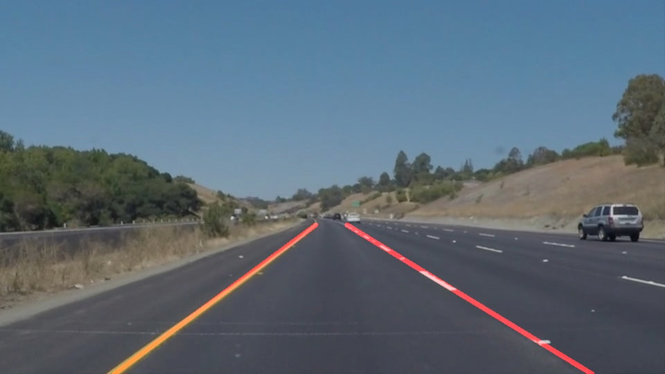

# **Finding Lane Lines on the Road** 
---

**Finding Lane Lines on the Road**

The goals / steps of this project are the following:
* Make a pipeline that finds lane lines on the road
* Reflect on your work in a written report
---

### Reflection

### 1. Lane Detection Pipeline

#### 0. original image

#### 1. Gaussian blur
- Apply gaussian blur to the original image.
- I didn't convert original image into gray scale because it deteriorate the detection accuracy of challenge.mp4 clip.
- Hyper parameter
    - kernel size: 5

#### 2. Canny Edge Detection
- Apply canny edge detection to the blurred image.
- I spend lot of time to find optimal value of low threshold and high threshold.
- Hyper parameter
    - low_threshold: 120
    - high_threshold: 150

#### 3. apply region of interest mask
- Apply roi mask to the edge detected image.
- Vertices of roi mask is calculated like below.
    - left bottom: (width * 0.1, height * 0.9)
    - left top: (width * 0.45, height * 0.6)
    - right top: (width * 0.55, height * 0.6)
    - right lower: (width * 0.9, height * 0.9)

- Except for the edges in the ROI mask, the rest are deleted.

#### 4. Hough line transform
- Apply hough transform to the masked image and get lines.
- hyperparameter
    - rho: 1
    - theta: np.pi/180
    - threshold: 15
    - min_line: 40
    - max_line_gap: 20

 

#### 5. Interpolate Line
- First, I split hough linesd based on it's slope. If the slope is positive and bigger than 0.3, then it's considered to the part of left lane. Else the slope is negative and smaller then 0.3, it's considered to the part of right land.
- After categorizing the lines into left lane and right lane, averaging the lines using cv2.polyfit(). The result is slope and bias of two averaged line.
- The averaged lines start at the bottom of the original image and end at the end of land. I approximated the end of land as (height of image * 0.6).

 

#### 6. interpolate line
- Draw the interpolated lines on the original image and return.

 

### 2. Shortcomings of current pipeline.
- Current pipeline can't recognize the difference between edges of the lane and edges of other things like shadow of trees. It makes confusion to the lane detection.
- Inside some frames, interval between lane segment is too wide. It' hard to find lane using only that frame.

### 3. Improvement Suggestion to the pipeline.
- Using machine learning algorithm to recognize the difference between the edges of lane and edges of others.
- Using previous frame and former frame to detect the lanes of current frame.

### 4. How did I solved challenge
- Challenge video has more complicated features like below.
    - Widht and height are different from example videos.
    - At the bottom of the image contain the front part of the car.
    - Tree shadows, crack on the roads are detected as edges which makes more confusion.
    - Curve of the lane is more stiff.
- I tried to solved those problems like below
    - Caculate the roi mask based on ratio of width and height of the image.
    - Move the bottom of roi mask upper so that it doesn't contain the front part of the car.
    - Raise the lower threshold of canny detection so that other things (tree shadow, crack on the road) are not detected as edges. 

